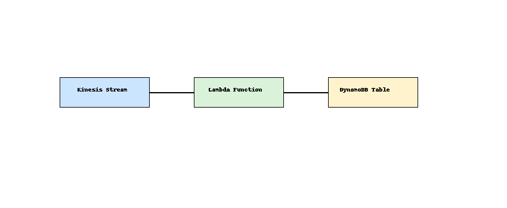

# Serverless Data Pipeline ⚙️🚀

This project creates a real-time serverless ETL pipeline using:

- Amazon Kinesis Data Stream for ingestion
- AWS Lambda for processing
- Amazon DynamoDB for storage
- Terraform for infrastructure deployment

## 🧩 Architecture



## 📁 Structure

- `terraform/` - Terraform modules for Kinesis, Lambda, DynamoDB
- `lambda/` - Lambda function code (Python)
- `README.md` - Overview and instructions

## 🛠️ Setup

### 1. Deploy Infrastructure

```bash
cd terraform
terraform init
terraform apply
```

### 2. Test the Pipeline

```bash
aws kinesis put-record \
  --stream-name demo-stream \
  --partition-key test123 \
  --data "eyJpZCI6ICIxMjMiLCAidmFsdWUiOiAiZm9vIn0="  # Base64 of JSON
```

### 3. Check DynamoDB

Visit the AWS Console → DynamoDB → Tables → `demo-items`

## 🔧 Requirements

- Terraform CLI
- AWS CLI configured
